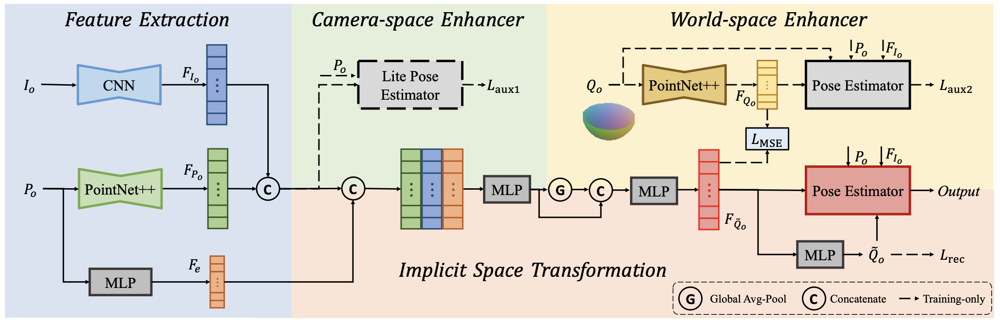

# IST-Net: Prior-free Category-level Pose Estimation with Implicit Space Transformation (ICCV2023)

This is the official implementation of ***IST-Net***. IST-Net is a clean, simple, and prior-free category-level pose estimator. 

<p align="center">
  IST-Net: Prior-free Category-level Pose Estimation with Implicit Space Transformation (ICCV2023) <br />
  <a href="https://arxiv.org/abs/2303.13479">[Paper]</a>, 
  <a href="https://sites.google.com/view/cvmi-ist-net/">[Project Page]</a> <br />
  <a href="https://sites.google.com/view/jianhuiliu/home">Jianhui Liu</a>, 
  <a href="https://yukangchen.com/">Yukang Chen</a>,
  <a href="https://shuluoshu.github.io/">Xiaoqing Ye</a>, 
  <a href="https://xjqi.github.io/">Xiaojuan Qi</a> 
</p>


<p align="center">  </p>

## Getting startted
#### ***Prepare the environment***

``` shell
conda create -n istnet python=3.6
conda activate istnet
# The code is tested on pytorch1.10 & CUDA11.3, please choose the properate vesion of torch
conda install pytorch==1.10.1 torchvision==0.11.2 torchaudio==0.10.1 cudatoolkit=11.3 -c pytorch -c conda-forge
# Dependent packages
pip install gorilla-core==0.2.5.3
pip install gpustat==1.0.0
pip install opencv-python-headless
pip install matplotlib
pip install scipy
```

#### ***Compiling***
```shell
# Clone this repo
git clone https://github.com/CVMI-Lab/IST-Net.git
# Compile pointnet2
cd model/pointnet2
python setup.py install
```

#### ***Prepare the datasets***
Following DPDN, please Download the folloing data [NOCS](https://github.com/hughw19/NOCS_CVPR2019) ([camera_train](http://download.cs.stanford.edu/orion/nocs/camera_train.zip), [camera_test](http://download.cs.stanford.edu/orion/nocs/camera_val25K.zip), [camera_composed_depths](http://download.cs.stanford.edu/orion/nocs/camera_composed_depth.zip), [real_train](http://download.cs.stanford.edu/orion/nocs/real_train.zip), [real_test](http://download.cs.stanford.edu/orion/nocs/real_test.zip),
[ground truths](http://download.cs.stanford.edu/orion/nocs/gts.zip),
and [mesh models](http://download.cs.stanford.edu/orion/nocs/obj_models.zip)) and segmentation results ([Link](https://drive.google.com/file/d/1hNmNRr7YRCgg-c_qdvaIzKEd2g4Kac3w/view?usp=sharing)). For camera_train.pkl, camera_val.pkl, real_test.pkl, real_rain.pkl, please download in this [Link](https://drive.google.com/file/d/1Nz7cwcQWO_In4K6jKN1-5pQ0orY4UV9x/view?pli=1). Then unzip them in data folder and arange them as follows:

```
data
├── CAMERA
│   ├── train
│   └── val
├── camera_full_depths
│   ├── train
│   └── val
├── Real
│   ├── train
│   └── test
├── gts
│   ├── val
│   └── real_test
├── obj_models
│   ├── train
│   ├── val
│   ├── real_train
│   ├── real_test
│   ├── camera_train.pkl
│   ├── camera_val.pkl
│   ├── real_train.pkl
│   └── real_test.pkl
├── segmentation_results
    ├── train_trainedwoMask
    ├── test_trainedwoMask
    └── test_trainedwithMask
```

### Data processing
```shell
python data_processing.py
```

### Training from scartch
```shell
# gpus refers to the ids of gpu. For single gpu, please set it as 0
python train.py --gpus 0,1 --config config/ist_net_default.yaml
```

### Training in seperate manner ###
If you want to achieve a higher result, we recommand you to train IST-Net in two phase. Phase 1, train the world-space enhancer(WE). Phase 2, freeze the world-space enhancer and train other component from scartch.
```shell
# Phase 1
python train.py --gpus 0,1 --config config/posenet_gt_default.yaml
# Phase 2, modify the [world_enhancer_path] in yaml file with the model weights saved in phase 1
python train.py --gpus 0,1 --config config/ist_net_freeze_world_enhancer.yaml
```


### Evaluation
```shell
python test.py --config config/ist_net_default.yaml
```

## Experimental results
If you want to get the same results reported in our paper. You can download the  weights below, and modify the test_path in the yaml file. (Eg. the weights are stored in /.../log/test_istnet/epoch_30.pth. Then fill the test_path in yaml file with /.../log/test_istnet/)

|   | IoU50 | IoU75 | 5 degree 2 cm | 5 degree 5 cm | 10 degree 2 cm | 10 degree 5 cm | 10 degree 10 cm | Pre-trained | 
|---|---|---|---|---|---|---|---|---|
| IST-Net | 82.5 | 76.6 | 47.5 | 53.4 | 72.1 | 80.5 | 82.6 | [Weights](https://drive.google.com/file/d/1rntagNJcFS3B4XNbPvugFC23b4tJZ3sZ/view?usp=sharing) |
| IST-Net freeze WE | 83.8 | 79.2 | 47.5 | 54.6 | 70.3 | 80.2 | 82.3 | [Weights](https://drive.google.com/file/d/1zlTWvsKXCVe7hTMC15bnaG14iA7RDSrN/view?usp=sharing) |


## Citation
If you find this project useful in your research, please consider citing:
```shell
@article{liu2023prior,
  title={Prior-free Category-level Pose Estimation with Implicit Space Transformation},
  author={Liu, Jianhui and Chen, Yukang and Ye, Xiaoqing and Qi, Xiaojuan},
  journal={arXiv preprint arXiv:2303.13479},
  year={2023}
}
```

## Acknowledgement
- Our code is developed upon [DPDN](https://github.com/JiehongLin/Self-DPDN).
- The dataset is provided by [NOCS](https://github.com/hughw19/NOCS_CVPR2019). 
